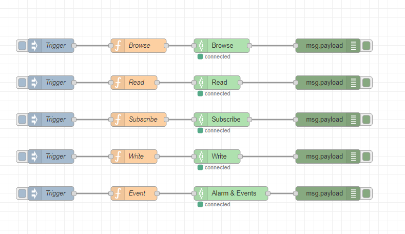

# node-red-contrib-opcua-client

A simple Node-RED module for interacting with OPC UA (Open Platform Communications Unified Architecture) servers. Easily read, write, browse, and subscribe to data and events.



## Features
* User-friendly interface
* Automatic reconnection on network or server failures
* Single node supporting multiple functionalities
* Reuse the same OPC UA connection across multiple nodes
* Support multiple OPC UA servers

## Getting started
Navigate to your Node-RED configuration folder and run:
```bash
npm install https://github.com/PO-CES-EDGE/node-red-contrib-opcua-client
```

## Contributing
Feel free to open issues or pull requests for bugs and enhancements. Please note that our support focuses on critical issues.

## Acknowledgments
This module was developed using [node-opcua](https://github.com/node-opcua/node-opcua), which provides the core functionality for handling OPC UA communication.

## License
This project is licensed under the terms of the Apache 2.0 license. For more information, see the [LICENSE](LICENSE) file.
